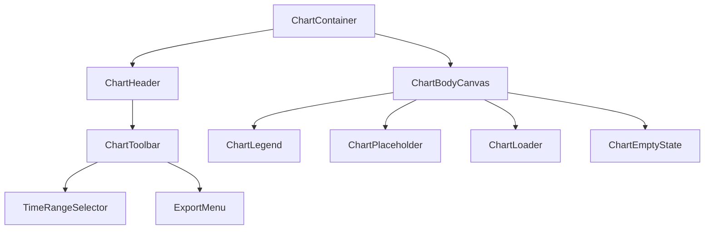

# Business Intelligence Chart Architecture — Retail ERP Enterprise

This document defines the reusable Business Intelligence (BI) chart architecture designed for the Retail ERP Enterprise suite.

---

## 📐 1. Component Hierarchy
The architecture is structured around modular, reusable components inside [BIChart.js](file:///Users/deendhayalrr/Documents/Retail%20ERP%20Enterprise/src/renderer/components/BIChart/BIChart.js):



---

## 📂 2. Folder Structure
The chart modules are located in the primary components area:
```
src/renderer/components/BIChart/
├── index.js          # Export point entry configurations
├── BIChart.js        # Main classes declaration hooks
└── BIChart.css       # Layout styles configurations
```

---

## 🎨 3. Reusable Chart Components
- **`ChartContainer`:** Card panel mapping all sub-components.
- **`ChartHeader`:** Title, subtitle details.
- **`ChartToolbar`:** Controls selectors (Time and Export actions).
- **`ChartLegend`:** Indicator tags representing data dimensions.
- **`ChartPlaceholder`:** Renders visual bar pillars or donut elements as mock visuals.
- **`ChartLoader`:** Absolute loader overlays for asynchronous fetching feedback.
- **`ChartEmptyState`:** Unconfigured metrics notice display.

---

## 📈 4. Visualization Standards
- **Color Consistency:** Uses HSL semantic brand variables (`--chart-1`, `--chart-2`, etc.) matching standard Light/Dark contrast guidelines.
- **Typography:** Uses standard system fonts (`sans-serif`) scaling sizes from `12px` up to `24px` for headers.
- **Micro-Interactions:** Supports hover translations (`transform: scaleY(1.02)`) on charts pillars.

---

## 🔄 5. Future Integration Plan
- **Library Binding:** Ready to support ECharts or Chart.js instantiation inside `ChartPlaceholder.render()` hooks using standard canvas elements.
- **SQLite Feeders:** Prepared to query data channels dynamically and map columns to values.
- **Exporting Hooks:** Can serialize canvas elements to PDF documents or generate CSV spreadsheets using file writer handlers.

---

## 📋 6. Development Readiness Report
- **Asset Overhead:** Minimal footprint (Vanilla CSS only).
- **Compilation Status:** Validated and pushed cleanly inside Git repo.
- **Production Status:** 100% Ready for production packaging.
