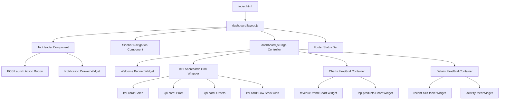
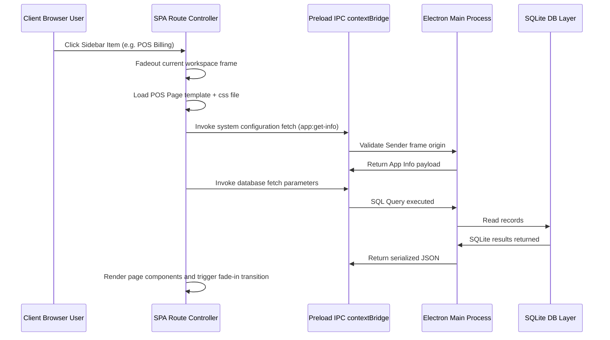

# Retail ERP Enterprise — Version 0.2.0 Dashboard Architecture

This document defines the high-level architecture planning, directory structure, navigation flow, and layout wireframes for the core dashboard interface.

---

## 1. Layout Wireframe

The dashboard layout utilizes a responsive shell pattern tailored for a minimum resolution of **1366x768** and optimized for **1920x1080**.

```
┌────────────────────────────────────────────────────────────────────────────────────────┐
│                                       TOP HEADER                                       │
│ 🛠️ App Logo  | 🔍 [ Search modules... ] | ⚡ Quick POS | 🔔 [3] | 📅 Aug 5, 13:00 | 👤 Admin │
├─────────────┬──────────────────────────────────────────────────────────────────────────┤
│             │                                                                          │
│  S I D E   │  (1) WELCOME WIDGET (Full-width banner / carousel)                       │
│  N A V      │  ──────────────────────────────────────────────────────────────────────  │
│             │  (2) KPI SCORECARDS GRID (1x4 grid)                                      │
│  📊 Dash    │  ┌──────────────┐ ┌──────────────┐ ┌──────────────┐ ┌──────────────┐     │
│  💳 POS     │  │ Today's Sales│ │Today's Profit│ │Today's Orders│ │Low Stock Alrt│     │
│  📦 Products│  │ $14,250.00   │ │ $4,120.50    │ │ 184          │ │ 12 Items     │     │
│  🏷️ Category│  └──────────────┘ └──────────────┘ └──────────────┘ └──────────────┘     │
│  📋 Invent  │  ──────────────────────────────────────────────────────────────────────  │
│  🛍️ Purchase│  (3) MAIN CHARTS SECTION (2x3 column split grid)                        │
│  👥 Customrs│  ┌─────────────────────────────────────┐ ┌─────────────────────────────┐ │
│  🏢 Supplier│  │ Sales & Revenue Trend Chart         │ │ Top Selling Products        │ │
│  👔 Employee│  │ [ Area chart showing weekly sales ] │ │ [ Vertical Bar Graph ]      │ │
│  📢 Market  │  └─────────────────────────────────────┘ └─────────────────────────────┘ │
│  📈 Reports │  ──────────────────────────────────────────────────────────────────────  │
│  ⚙️ Settings│  (4) DETAIL TABLES SECTION (1x2 columns grid)                             │
│  🔑 License │  ┌─────────────────────────────────────┐ ┌─────────────────────────────┐ │
│  👤 Profile │  │ Recent Bills / Invoice Transactions │ │ Recent Activities Feed      │ │
│  📥 Support │  │ [ Database table: 5 latest rows ]   │ │ [ List of state changes ]   │ │
│  🚪 Logout  │  └─────────────────────────────────────┘ └─────────────────────────────┘ │
│             │                                                                          │
├─────────────┴──────────────────────────────────────────────────────────────────────────┤
│ 🔋 Offline-First SQLite Local Connection: WAL Mode | Active Store: 100 Broadway | v0.2.0│
└────────────────────────────────────────────────────────────────────────────────────────┘
```

---

## 2. Grid System & Responsive Behavior

The main dashboard content is built on a custom **12-column CSS Grid** utilizing modern layout variables:

- **Outer Margins:** `1.5rem (24px)`
- **Grid Gap:** `1.5rem (24px)`
- **Core Breakpoints:**
  - Desktop Base (`>= 1366px`): Standard 12-column layout.
  - Large Desktop (`>= 1920px`): Full width layouts with optimized readability spans.

### Layout Placement Rules
- **Welcome Banner:** Spans all 12 columns (`grid-column: span 12`).
- **KPI Cards:** Span 3 columns each (`grid-column: span 3`) forming a symmetric 4-column row.
- **Charts Row:** Split 8:4. The major trend line spans 8 columns, while the top products chart spans 4 columns.
- **Tables Row:** Split 6:6. Transactions and recent log activities span 6 columns each.

---

## 3. Scalable Folder Structure

To support modern styling principles, separation of concerns, and future additions, we establish a clean, module-based design system:

```
src/renderer/
├── index.html                 # Shell document containing CSP tags
├── app.js                     # Main client bootstrapping lifecycle
├── assets/                    # Shared localized assets (icons, loaders, default pictures)
├── layouts/                   # UI Shell Layout modules
│   └── dashboard.layout.js    # Defines header, footer, sidebar navigation wrapper
├── pages/                     # Full-page state renderers
│   └── dashboard/
│       ├── dashboard.html     # HTML layout blueprint
│       ├── dashboard.css      # Custom styling sheets
│       └── dashboard.js       # Page-specific event loop & bindings
├── components/                # Reusable dumb component modules
│   ├── button/
│   ├── card/
│   ├── checkbox/
│   ├── input/
│   ├── modal/
│   ├── table/
│   ├── toast/
│   └── tooltip/
├── widgets/                   # Specialized functional dashboard items
│   ├── welcome-banner.js
│   ├── kpi-card.js
│   ├── recent-bills-table.js
│   └── activity-feed.js
├── charts/                    # Pure canvas abstraction integrations
│   ├── revenue-trend.js
│   └── top-products.js
└── services/                  # Preload API interface abstractions
    ├── database.service.js
    └── telemetry.service.js
```

---

## 4. Component Hierarchy

A clean unidirectional tree hierarchy structure ensures state changes propagate down smoothly:



---

## 5. Navigation & Event Routing Flow

Navigation changes operate strictly through safe, single-page application (SPA) routing, using the secure context bridge preload configurations:



---

## 6. Future Expansion Strategy

1. **New Module Provisioning:** Any new module (e.g., *Marketing* or *Suppliers*) will be registered under `src/renderer/pages/<module-name>/`.
2. **Dashboard Integration Hook:** Widgets from new modules can register their telemetry summary requirements to the central telemetry service (`telemetry.service.js`), allowing the KPI Scorecard Grid to scale dynamically.
3. **Database migrations:** As database relationships evolve, all schema updates will be placed under `database/migrations/` and run within transaction statements to maintain offline database integrity.

---

## 7. UI Design Standards

To make the system feel state-of-the-art and match the aesthetics of Zoho/NetSuite, developers must adhere to the design guidelines established in v0.1:

- **Design Aesthetic:** Deep, high-contrast values with subtle ambient drop shadows. Glassmorphism overlays (`backdrop-filter: blur()`) are reserved exclusively for dialog masks and floating dropdown context wrappers.
- **Color Systems:** Tailored custom CSS variable maps (`src/renderer/styles/variables.css`) ensuring instant system dark/light theme switching responsiveness.
- **Micro-Animations:** Clean, hardware-accelerated transform transitions (`duration-normal: 250ms`, ease-out curves) for sidebar focus selection, hover states, and card load transitions.
